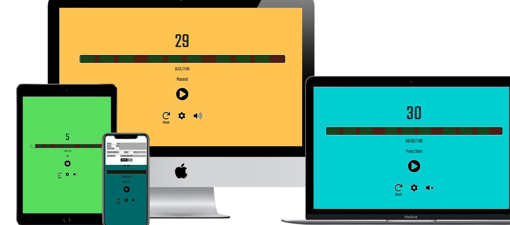

# Workout Interval Timer
This is a single page website for an Interval Workout timer. It is designed to be simple and intuitive to use.
The user can instantly change the work/rest period length to suit their needs and the UI features large buttons, allowing the user to easily start and stop the timer as they need. The primary goal of this website is to provide a responsive, accessible and easy-to-use, browser-based timer for interval training

---



---

### - Strategy: What are we aiming to achieve and for whom?
- We want to make a timer that keeps time accurately.
- We want to make a timer that can be used for interval workouts.
- We want a timer that can take user input to change the work/rest times.
- We want a progress bar that shows overall progress and progress within each round.
- We want an interface that will change appearance depending on the state of the timer and display an appropriate message.
- We want a timer that can do a count-down before starting so users have time to prepare.
- We want an audio cue to signal the end of a work/rest period.
- We want to create a website that is easy and intuitive to use.
- We want to create a site that is easy to view on all screen sizes.

---

### - Scope: What features (based on information from the Strategy) do you want to include in your design? What's on the table and what's not(at least for now)?
- Intuitive user interface.
- Customizable work and rest times.
- Option for an extended break after a set number of rounds.
- Alarm or bell sound after rounds/breaks.
- Progress bar showing current position in workout.
- Options should be collapsible, to leave a minimal interface when timer is running.

---

### - Structure: How is the information structured, and how is it logically grouped?
- Single page layout.
- Simple, minimal UI for ease of use.
- Play/Pause button and time display should be the largest elements on the page.
- Settings should be hidden when not in use.

---

### - Skeleton: How will our information be represented, and how will the user navigate to the information and the features?
###### Wireframes:
- [Desktop](wireframes/desktop.png)
- [Mobile](wireframes/mobile.png)

---

### - Surface: What will the finished product look like? - What colors, typography, and design elements will we use?
- Minimal interface.
- Contrasting accents for work/rest times to act as instant visual signal to users.

---

### - Existing Features
 - Simple design and layout.
 - Large time display and play/pause button.
 - Reset button to stop timer and clear progress.
 - Progress bar with segments for each work/rest period.
 - Progress time display showing total time elapsed and total runtime of timer.
 - Message display showing a different message depending on the current state of the timer.
 - Audio alert at the end of each countdown and round.
 - Mute button for audio alert.
 - Settings modal with inputs to customize the length of work/rest periods, extended breaks and the countdown.
 - Settings only accept valid inputs and will notify the user if the input is invalid.

---

### - Potential features to be implemented
  - Information button to reveal info about Interval training and the purpose of the timer.
  - Option for user to add their own alert sound.
  - Option for user to customize the timer colors.
  - Change progress bar to stopwatch with hand to indicate current position.

---

### - Technologies Used
 - HTML
 - CSS
 - JavaScript
 - [Bootstrap 5](https://getbootstrap.com/docs/5.0/getting-started/introduction/) Bootstrap was used mainly for the modal, layout and spacing.
 - [Google Fonts](https://fonts.google.com/specimen/Teko?preview.text=35%20Paused&preview.text_type=custom&sidebar.open=true&selection.family=Teko) Teko font was used for this project.

---

### - Testing
- [W3C HTML Validation Service](https://validator.w3.org/) was used to validate the HTML.
- [W3C CSS Validation Service](https://jigsaw.w3.org/css-validator/) was used to validate the CSS.
- [JShint for VSCode](https://marketplace.visualstudio.com/items?itemName=dbaeumer.jshint) was used to check JavaScript for errors.
 - This project was tested with the following browsers on Windows 10:
    - Google Chrome
    - Mozilla Firefox
    - Opera
    - Microsoft Edge
  - The following mobile devices and browsers were used for testing:
    - Xiaomi Redmi Note 7 Google Chrome, Firefox
    - Lenovo Tab 4 10 Google Chrome  
  
  #### With each device and browser the following steps were taken:
  - (On desktop) Resize the window to ensure the layout and spacing remains consistent from 320 pixel width and above
  - Test the play/pause button to ensure the timer starts and can be paused
  - Allow the countdown to finish and ensure it runs every time the timer is started/resumed
  - Ensure the timer runs through to the end and the appropriate messages and colors are displayed throughout and when the timer is finished
  - Ensure that the reset button has the correct effect if the timer is running or not.
  - Ensure the settings button triggers the modal
  - Ensure the cancel button will close the modal and restore the current settings to the inputs
  - Ensure the settings can be updated and the extended break and countdown can be disabled
  - Ensure that the update button only works if all inputs are valid
  - Ensure that the mute button functions as expected and test it when there is audio currently playing

---

### - Issues
 - When the start button is pressed during countdown the timer malfunctions and becomes unresponsive until page is refreshed.
   - Fixed by combining start & pause buttons into a single play/pause button.
 - If timer is updated when it is running, the button does not change to 'play'.
   - Fixed by calling the playPauseTimer function when timer is updated while it is running.
 - If user inputs values into the settings and doesn't update the timer, the values will not change back to the current timer settings.
    - When the 'cancel' button is pressed, restore the input values to the current timer settings.

---

### - Deployment
This project was deployed to GitHub pages using the following steps:

 - Navigate to the [GitHub Repository Page](https://github.com/oisintohak/Milestone-Project-2)
 - Go to the [Settings](https://github.com/oisintohak/Milestone-Project-2/settings) page and scroll down to the GitHub Pages section
 - Select the main branch and save
 - After the page refreshes, the link to the live page will be in the GitHub Pages section

To run this project locally:
 - Navigate to the [GitHub Repository Page](https://github.com/oisintohak/Milestone-Project-2)
 - Click code and copy the URL to clone with HTTPS
 - In a terminal with git installed navigate to the directory where you want the repository to be cloned
 - Run 'git clone' followed by the URL you copied:
 - ```git clone https://github.com/oisintohak/Milestone-Project-2.git```

---

### - Credits
####  Code
The method for keeping time accurately (by comparing a current Date object to one previously recorded) was taken from [this article by Jamie Uttariello](https://olinations.medium.com/an-accurate-vanilla-js-stopwatch-script-56ceb5c6f45b)

####  Audio
The beep sounds used in the timer were taken from 
[https://mixkit.co/free-sound-effects/beep/](https://mixkit.co/free-sound-effects/beep/)

####  Icons
  -  Favicon taken from [Flaticon.com](https://www.flaticon.com/)
  -  Other icons taken from [Fontawesome](https://fontawesome.com/)

#### Acknowledgements
  - I received great advice and feedback from my mentor Ignatius Ukwuoma.